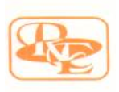

# R.K. Erectors — Official Website

> **Engineering Excellence**

Official website for **R.K. Erectors**, showcasing the company's industrial engineering, fabrication, erection, and infrastructure capabilities across major industrial sectors.

🌐 **Live Website:** https://rkerectors.dpdns.org/

---

## 📌 About The Project

The **R.K. Erectors Official Website** is a modern, immersive and responsive company website designed to present the organization's industrial capabilities, services, projects and company information through a visually engaging digital experience.

The website focuses on creating a professional industrial identity while combining modern web technologies with cinematic visuals and smooth scrolling interactions.

The project was developed with a strong emphasis on:

- Modern UI/UX
- Responsive design
- Cinematic visual experience
- Smooth scrolling
- Interactive sections
- Industrial branding
- Performance optimization
- SEO readiness
- Mobile responsiveness

---

## 🏢 About R.K. Erectors

**R.K. Erectors** is an industrial engineering and construction organization involved in industrial fabrication, erection and engineering services.

The website represents the company's work across sectors including:

- Steel Plants
- Power Plants
- Cement Plants
- Industrial Infrastructure
- Structural Fabrication
- Mechanical Erection
- Piping & Industrial Systems
- Engineering Projects

---

# ✨ Features

## 🎬 Cinematic Hero Experience

The homepage begins with a cinematic loading experience followed by an immersive hero section.

Features include:

- Preloading animation
- Cinematic image sequence
- Full-screen hero presentation
- Company branding
- Animated typography
- Smooth transition into the main website

---

## 🖼️ Frame-Based Visual Animation

Instead of relying on a conventional video player, the website uses a sequence of image frames to create a cinematic animation experience.

The frame sequence provides:

- Smooth visual transitions
- Better control over animation
- Custom playback behavior
- Interactive scrolling possibilities
- Consistent rendering across devices

---

## 🧭 Smooth Scrolling

The website uses smooth scrolling interactions to create a premium browsing experience.

Users can navigate through different sections while maintaining visual continuity between the content and animations.

---

## 📱 Responsive Design

The website is designed to work across different screen sizes:

- Desktop
- Laptop
- Tablet
- Mobile devices

The layout adapts to different viewport dimensions while maintaining the visual identity of the website.

---

## 🏗️ Industrial Company Presentation

The website presents important company information through dedicated sections such as:

- Company introduction
- Services
- Industrial capabilities
- Projects
- Infrastructure
- Company profile
- Contact information

---

## 📄 Company Profile

The project includes the official company profile/documentation which can be accessed through the website.
company profile pdf/
🛠️ Technologies Used
HTML5
CSS3
JavaScript
React
Vite
Git
GitHub
Vercel
📂 Project Structure
rk-test/
│
├── api/
│
├── company profile pdf/
│
├── public/
│   ├── logo/
│   ├── frames/
│   ├── robots.txt
│   └── sitemap.xml
│
├── src/
│
├── .gitignore
├── eslint.config.js
├── index.html
├── package.json
├── package-lock.json
└── README.md
🚀 Getting Started
1. Clone the Repository
git clone https://github.com/san-codes9234/rk-test.git
2. Open the Project
cd rk-test
3. Install Dependencies
npm install
4. Start Development Server
npm run dev

The development server will normally run at:

http://localhost:5173
🏗️ Production Build

Create a production build using:

npm run build

To preview the production build:

npm run preview
🔍 SEO

The website includes SEO configuration such as:

Page title
Meta description
Meta keywords
Author metadata
Robots metadata
Canonical URL
Sitemap
Robots.txt

The official canonical website URL is:

https://rkerectors.dpdns.org/
🤖 Search Engine Configuration

The project includes:

public/robots.txt
public/sitemap.xml

These files help search engines discover and crawl the website.

The website has been configured for Google Search Console with sitemap submission and URL inspection.

🌐 Deployment

The website is deployed using Vercel and connected to the official domain:

https://rkerectors.dpdns.org/

Deployment architecture:

GitHub Repository
        ↓
      Vercel
        ↓
Production Deployment
        ↓
Custom Domain
        ↓
https://rkerectors.dpdns.org/
⚡ Performance

The website uses a frame-based cinematic animation system that loads a large number of image resources.

Initial loading time can therefore depend on:

Internet connection
Browser cache
Device performance
DNS response time
CDN performance
Number of animation frames
Image sizes
📈 Future Improvements

Possible future improvements include:

WebP/AVIF image conversion
Image compression
Responsive image loading
Lazy loading
Progressive frame loading
CDN optimization
Adaptive loading
Improved caching strategies
🔐 Security

Sensitive credentials and environment variables should not be committed to the repository.

The .gitignore file is used to prevent unnecessary or sensitive files from being tracked.

🧪 Development Workflow
npm install
npm run dev

Before deployment:

npm run build

The production build should be tested before major changes are deployed.

👨‍💻 Author

Sakalp Kumar

Engineering Student & Developer

GitHub:

https://github.com/san-codes9234

📜 License

This project is created for the official digital presence of R.K. Erectors.

The website design, content, branding assets, company documents and proprietary materials belong to their respective owners.

The source code should not be reused for commercial purposes without appropriate authorization.

📞 Contact

For business-related information, services, projects or company enquiries, please visit:

https://rkerectors.dpdns.org/

⭐ R.K. Erectors

Engineering Excellence

Industrial Fabrication • Erection • Engineering • Infrastructure
